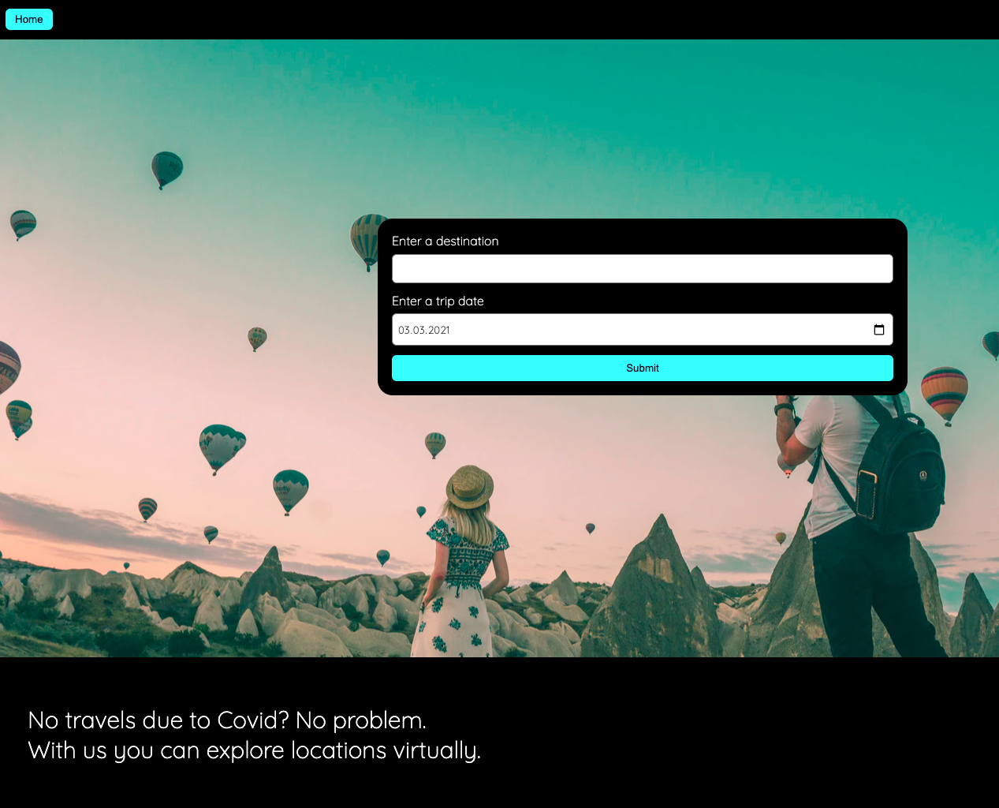

# Travel App

A Udacity Frontend Webdeveloper Nanodegree Project.

## Story
You can't travel but you can dream - and visit places virtually.

### A virtual trip
This app lets you plan virtual trips. 
You enter a destination, and a start date for your trip - any date between today and the coming year will work.
Your trip view will include the current weather forecast, or a prediction based on previous years' weather. 
You will also be able to browe pictures other travellers took.

### Saving trips
After viewing your trip results, you are able to save your favorite destinations, and revisit them even after you closed your browser window. (This works via localstorage, but could be replaced or extended to server side storage.)

### Voting for favorite destinations
You particularly like a destination?
Vote for it to be added to the website's favorites.
A vote will send a request to the server, where data from all users and devices can be analysed.

## Setup
- Developed with node express.
- Built with webpack.
- Tested with jest.

### Environment Variables
The following environment variables are used and need to be provided via provess.env in order for the project to run successfully:
GEONAMES_USERNAME=***
WEATHERBIT_APIKEY=***
PIXABAY_APIKEY=***

## APIs used
Weatherbit for Weaterdata (Forecast and History)
Geonames for converting destinations to their longitude and latitude location.
Pixabay and Unsplash for pictures.

## Remarks for Review
Saving trips is implemented via access to localstorage.

## Teaser

